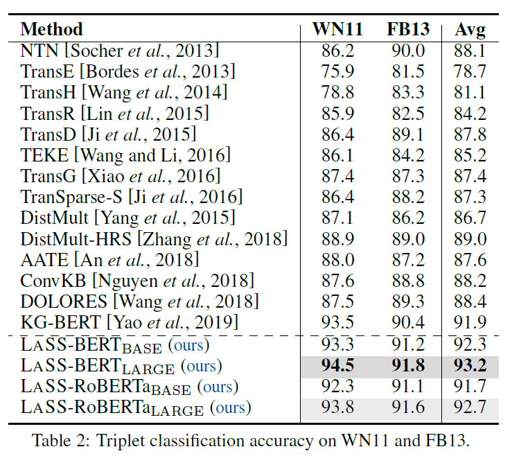
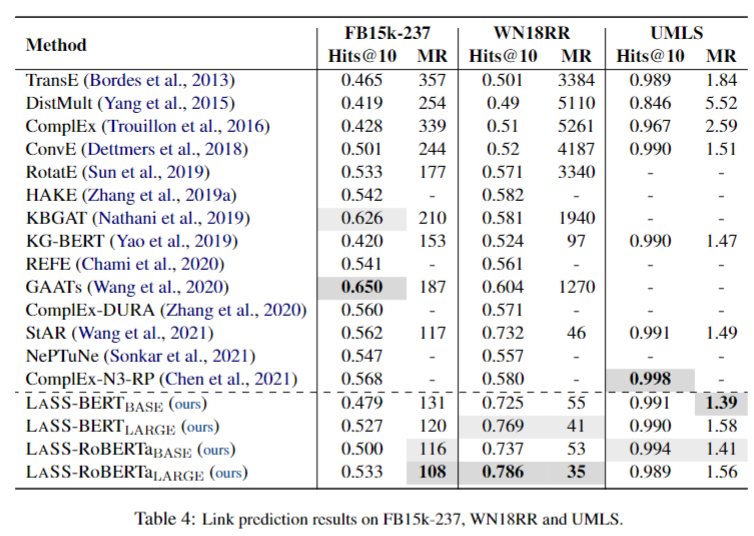

[](https://paperswithcode.com/sota/link-prediction-on-wn18rr?p=joint-language-semantic-and-structure)
[](https://paperswithcode.com/sota/link-prediction-on-umls?p=joint-language-semantic-and-structure)
[](https://paperswithcode.com/sota/link-prediction-on-fb15k-237?p=joint-language-semantic-and-structure)

# Joint Language Semantic and Structure Embedding for Knowledge Graph Completion

The source code repo for paper [Joint Language Semantic and Structure Embedding for Knowledge Graph Completion](https://arxiv.org/abs/2209.08721), COLING 2022.

## Setup Dataset and Dependencies

Requires Python version 3.7 or above. Python 3.7.9 is tested.

Requires PyTorch version 1.8.1 or above with CUDA. PyTorch 1.8.1 with CUDA 11 is tested. Please refer to https://pytorch.org/get-started/locally/ for installing PyTorch.

```
python -m pip install -r requirements.txt
cd data
bash prepare_data.sh
cd ..
```

## Hardware Requirements

8 GPUs required. 12GB GPU memory required for running BERT-Base (110M parameters) or RoBERTa-Base (123M parameters). 32GB GPU memory required for running BERT-Large (336M parameters) or RoBERTa-Large (353M parameters). We run our experiments on 8x NVIDIA V100 SXM2 32G GPUs. Internet connection required for downloading pre-trained language models and vocabulary files.

## Scripts for Reproducing Results

### Link Prediction

```
bash FB15k-237_bert_base.sh
bash FB15k-237_bert_large.sh
bash FB15k-237_roberta_base.sh
bash FB15k-237_roberta_large.sh
bash WN18RR_bert_base.sh
bash WN18RR_bert_large.sh
bash WN18RR_roberta_base.sh
bash WN18RR_roberta_large.sh
bash umls_bert_base.sh
bash umls_bert_large.sh
bash umls_roberta_base.sh
bash umls_roberta_large.sh
```

### Triplet Classification

```
bash FB13_bert_base.sh
bash FB13_bert_large.sh
bash FB13_roberta_base.sh
bash FB13_roberta_large.sh
bash WN11_bert_base.sh
bash WN11_bert_large.sh
bash WN11_roberta_base.sh
bash WN11_roberta_large.sh
```

## Experiment Results

### Triplet Classification



### Link Prediction



## Citation

```bibtex
@inproceedings{shen-etal-2022-lass,
    title = "Joint Language Semantic and Structure Embedding for Knowledge Graph Completion",
    author = "Jianhao Shen and Chenguang Wang and Linyuan Gong and Dawn Song",
    booktitle = "Proceedings of the 29th International Conference on Computational Linguistics",
    year = "2022",
    publisher = "International Committee on Computational Linguistics"
}
```

